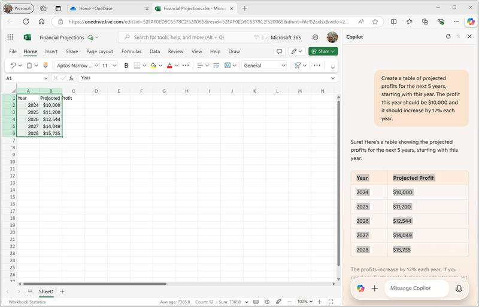

# ใช้ Copilot เพื่อสร้างและแสดงผลการคาดการณ์ทางการเงิน

> **หมายเหตุ**: คุณควรมี [บัญชี Microsoft Account](https://signup.live.com) แบบส่วนตัว (เช่น outlook.com) และเข้าสู่ระบบด้วยบัญชีนี้บนคอมพิวเตอร์ของคุณ หากคุณมีทั้งบัญชีที่ใช้งานในที่ทำงานและบัญชีส่วนตัว โปรดเลือกบัญชี *ส่วนตัว* ในการตั้งค่าบัญชีด้านบนซ้ายของ Microsoft Edge

ด้วยความช่วยเหลือจาก **Copilot** คุณได้สร้างร่างแผนธุรกิจสำหรับไอเดียธุรกิจบริการทำความสะอาดแล้ว ตอนนี้เราจะใช้ Copilot ในการคำนวณบางอย่างเพื่อช่วยปรับปรุงแผนธุรกิจให้ดียิ่งขึ้น

1. ใน **OneDrive** ให้ใช้ปุ่ม **(+)** เพื่อเพิ่ม **Excel workbook** ใหม่ จากนั้นเปลี่ยนชื่อไฟล์เป็น `Financial Projections`

2. ใน **Copilot Pane** ป้อนพรอมต์นี้:

   ```prompt
   Create a table of projected profits for the next 5 years, starting with this year. The profit this year should be $10,000 and it should increase by 12% each year.
   ```
    ภาษาไทย
    ```prompt
    สร้างตารางประมาณการกำไรสำหรับ 5 ปีข้างหน้า โดยเริ่มต้นจากปีนี้ กำไรปีนี้ควรเป็น 10,000 บาทและควรเพิ่มขึ้นทุกปี 12%
    ```

3. ตรวจสอบคำตอบ ซึ่งควรแสดงตารางประมาณการกำไรสำหรับ 5 ปีข้างหน้า

4. คัดลอกตารางไปยังคลิปบอร์ด (ตรวจสอบให้แน่ใจว่าคัดลอกเฉพาะตารางเท่านั้น) จากนั้นเลือกเซลล์ **A1** ใน Excel workbook และไปที่แท็บ **Home** ในเมนู **Clipboard** ใต้ **Paste special** ให้เลือก **Values only** เพื่อวางค่าจากตารางลงในสเปรดชีต  
   

5. ใน **Copilot Pane** ป้อนพรอมต์นี้:

   ```prompt
   What's a good way to visualize these projections in a chart?
   ```
    ภาษาไทย
    ```prompt
    บอกวิธีที่ดีที่สุดในการแสดงข้อมูลการคาดการณ์นี้ในรูปแบบกราฟ
    ```

6. ตรวจสอบคำตอบ ซึ่งควรแนะนำวิธีต่างๆ ในการแสดงผลข้อมูลการคาดการณ์ จากนั้นป้อนพรอมต์นี้:

   ```prompt
   How do I create a line chart in Excel?
   ```
    ภาษาไทย
    ```prompt
    ฉันจะสร้าง line chart ใน Excel อย่างไร
    ```

7. ทำตามคำแนะนำจาก Copilot เพื่อสร้างกราฟเส้นใน Excel  

> 💡 **เคล็ดลับ**: คุณอาจต้องปรับแกนข้อมูลที่ Excel เลือกไว้โดยอัตโนมัติ  
   - เลือกกราฟในสเปรดชีต  
   - ไปที่แท็บ **Chart** และเลือก **Select Data**  
   - ใน **Chart Pane** บนแท็บ **Data** ปรับการตั้งค่าเพื่อให้ช่อง **Year** เป็นป้ายกำกับแนวนอน และใช้เฉพาะช่อง **Projected Profit** เป็นค่าบนกราฟเส้น  

   

8. ปิดแท็บ **Chart** เพื่อดูกราฟในสเปรดชีต

9. ปิดแท็บ Microsoft Excel และกลับไปที่ **OneDrive**

## สรุป

ในขั้นตอนนี้คุณได้ใช้ **Copilot** ในการสร้างแผนธุรกิจและกราฟเส้นเพื่อแสดงการคาดการณ์การเงินของธุรกิจของคุณ 