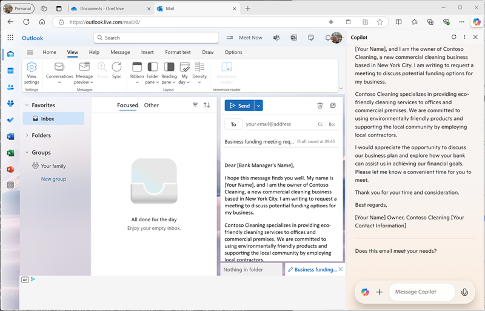

# การสรุป วางแผนงาน และร่างเนื้อหาอีเมลล์ ใน Outlook

> **หมายเหตุ**: คุณควรมี [บัญชี Microsoft Account](https://signup.live.com) แบบส่วนตัว (เช่น outlook.com) และเข้าสู่ระบบด้วยบัญชีนี้บนคอมพิวเตอร์ของคุณ หากคุณมีทั้งบัญชีที่ใช้งานในที่ทำงานและบัญชีส่วนตัว โปรดเลือกบัญชี *ส่วนตัว* ในการตั้งค่าบัญชีด้านบนซ้ายของ Microsoft Edge

หลังจากสร้างเนื้อหาสำหรับเริ่มต้นธุรกิจแล้ว ตอนนี้ถึงเวลาติดต่อกับนักลงทุนเพื่อขอเงินทุนสำหรับเริ่มต้นธุรกิจ

1. ใช้ **App Launcher** (&#8759;) ที่มุมซ้ายบนของแถบชื่อ **OneDrive** เพื่อเปิด **Outlook**

2. ไปที่หน้า **Calendar** และเปลี่ยนมุมมองเป็น **Work week**  
   - หากปฏิทินของคุณยังไม่มีการนัดหมาย คุณสามารถเพิ่มการนัดหมายสองสามรายการเพื่อให้ Copilot มีข้อมูลในการทำงาน

3. ใช้พรอมต์นี้เพื่อตรวจสอบตารางเวลาของคุณสำหรับการประชุมกับผู้จัดการธนาคารเพื่อนัดหมายการขอทุน:

   ```prompt
   What's my availability for a meeting this week?
   ```
    ภาษาไทย
    ```prompt
    มีเวลาว่างไหมสำหรับการนัดหมายใหม่ในสัปดาห์นี้
    ```

4. Copilot จะแสดงสรุปความพร้อมของคุณสำหรับสัปดาห์นี้ตามข้อมูลในปฏิทิน  

> ⚠️ **หมายเหตุ**: Microsoft Copilot สามารถอ่านข้อมูลจากปฏิทินที่เปิดอยู่ในเบราว์เซอร์ได้ (และอาจ "จำ" รายละเอียดในระหว่างเซสชันปัจจุบัน) แต่ไม่สามารถเข้าถึงข้อมูลปฏิทินของคุณโดยตรงได้  
> ในสภาพแวดล้อมองค์กร **Microsoft 365 Copilot** สามารถเข้าถึงปฏิทินและอีเมลของคุณใน Outlook รวมถึงข้อมูลจากแอปอื่นๆ เช่น **Microsoft Teams**

7. สลับไปที่หน้า **Mail** และสร้างอีเมลใหม่  
   - กรอกที่อยู่อีเมลของคุณเองในช่อง **To**  
   - ใส่หัวข้ออีเมลเป็น `Business funding meeting request`

8. ใน **Copilot Pane** ป้อนพรอมต์นี้:

   ```prompt
   Write an email to a bank manager requesting a meeting to discuss funding for a commercial cleaning business. The email should be concise and the tone should be professional.
   ```
    ภาษาไทย
    ```prompt
    เขียนอีเมลล์ถึงผู้จัดการธนาคารขอนัดหมายเพื่อพูดคุยเรื่องการให้ทุนสำหรับธุรกิจทำความสะอาดพื้นที่สำนักงาน อีเมลควรสรุปให้กระชับ และมีสำนวนแบบมืออาชีพ
    ```

9. ใช้เนื้อหาที่ Copilot สร้างขึ้นเพื่อนำมาเติมเต็มในอีเมลของคุณ  
   - ตัวอย่างอีเมลที่สร้างโดย Copilot จะมีลักษณะดังนี้:  
   

10. คุณสามารถส่งอีเมลนี้ถึงตัวเองเพื่อตรวจสอบความถูกต้องได้! 🚀

## สรุป

ในขั้นตอนนี้คุณได้ใช้ **Copilot** ในการสร้างเนื้อหาอีเมลล์เพื่อขอทุนธุรกิจจากธนาคาร และตรวจสอบตารางเวลาของคุณสำหรับการนัดหมายกับผู้จัดการธนาคาร