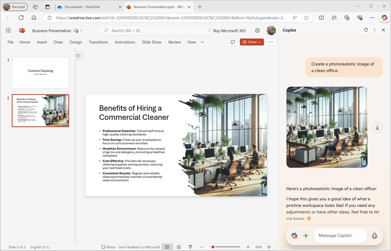
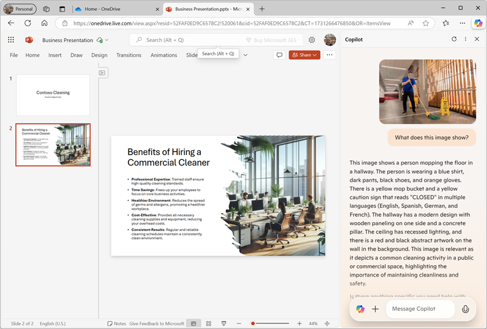
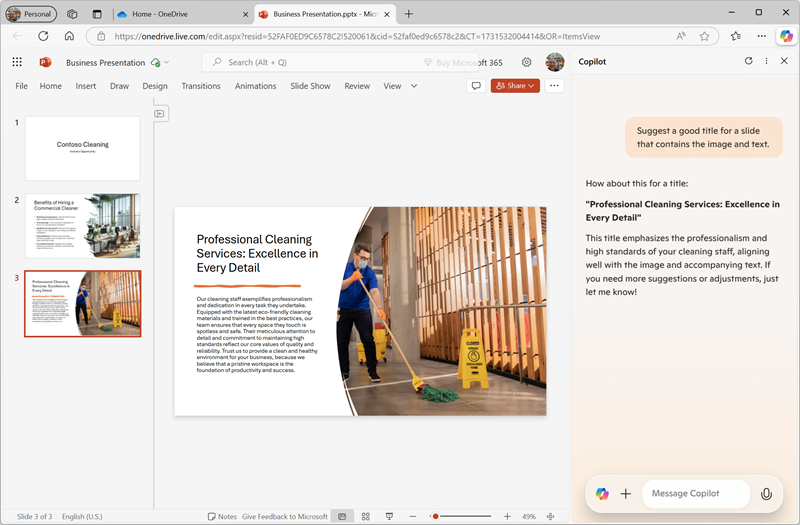

# ใช้ Copilot เพื่อสร้างเนื้อหาสำหรับงานนำเสนอ

> **หมายเหตุ**: คุณควรมี [บัญชี Microsoft Account](https://signup.live.com) แบบส่วนตัว (เช่น outlook.com) และเข้าสู่ระบบด้วยบัญชีนี้บนคอมพิวเตอร์ของคุณ หากคุณมีทั้งบัญชีที่ใช้งานในที่ทำงานและบัญชีส่วนตัว โปรดเลือกบัญชี *ส่วนตัว* ในการตั้งค่าบัญชีด้านบนซ้ายของ Microsoft Edge

ด้วยความช่วยเหลือจาก **Copilot** คุณได้สร้างแผนธุรกิจและการคาดการณ์ทางการเงินสำหรับธุรกิจทำความสะอาดแล้ว ตอนนี้เราจะใช้ Copilot เพื่อสร้างงานนำเสนอที่มีประสิทธิภาพเพื่อโน้มน้าวนักลงทุนให้สนับสนุนเงินทุนสำหรับเริ่มต้นธุรกิจ

1. ใน **OneDrive** ให้เพิ่ม **PowerPoint presentation** ใหม่  
   - หาก **Designer Pane** เปิดขึ้นโดยอัตโนมัติ ให้ปิดไป  
   - เปลี่ยนชื่อไฟล์จาก *Presentation* เป็น `Business Presentation`

2. บนสไลด์แรก ให้ใส่ชื่อบริษัททำความสะอาดของคุณเป็น **Title** และใส่ `Investor Opportunity` เป็น **Subtitle**

3. เพิ่มสไลด์ใหม่ โดยใช้เลย์เอาต์ **Two Content** (ประกอบด้วย Title และพื้นที่สองส่วนสำหรับเนื้อหา)

4. เปลี่ยนชื่อสไลด์เป็น `Benefits of Hiring a Commercial Cleaner`

5. ใน **Copilot Pane** ป้อนพรอมต์นี้:

   ```prompt
   Write a summary of the benefits of using a corporate cleaning company for your business. The summary should consist of five short bullet points.
   ```
    ภาษาไทย
    ```prompt
    สรุปประโยชน์ของการใช้บริษัททำความสะอาดสำหรับดูแลเรื่องความสะอาดในบริษัทของลูกค้า สรุปควรประกอบด้วยสรุปรายการสั้นๆ 5 ข้อ
    ```


6. คัดลอกคำตอบจาก Copilot ไปยังคลิปบอร์ด และวางลงในพื้นที่เนื้อหาทางด้านซ้ายของสไลด์ จากนั้นแก้ไขและจัดรูปแบบข้อความตามต้องการ

7. ใน **Copilot Pane** ป้อนพรอมต์นี้:

   ```prompt
   Create a photorealistic image of a clean office.
   ```
    ภาษาไทย
    ```prompt
    สร้างรูปภาพที่มีลักษณะเหมือนจริงของสำนักงานที่สะอาด
    ```

8. เมื่อ Copilot สร้างภาพที่คุณชอบแล้ว ให้คัดลอกภาพนั้นไปยังคลิปบอร์ด และวางลงในพื้นที่เนื้อหาทางด้านขวาของสไลด์  

- หาก **Designer Pane** เปิดขึ้นโดยอัตโนมัติ ให้เลือกดีไซน์ที่คุณชอบ แล้วปิด **Designer Pane**

9. ปรับแต่งสไลด์เพิ่มเติมตามความเหมาะสม จนได้ผลลัพธ์ที่คุณพอใจ  
   

10. เปิดแท็บเบราว์เซอร์ใหม่และดาวน์โหลดภาพ [mopping.png](https://github.com/MicrosoftLearning/mslearn-copilot/raw/main/Allfiles/mopping.png) จาก `https://github.com/MicrosoftLearning/mslearn-copilot/raw/main/Allfiles/mopping.png` ลงในคอมพิวเตอร์ของคุณ

11. กลับไปที่แท็บ PowerPoint เดิม และใน **Copilot Pane** ให้ใช้ปุ่ม **+** ข้างช่องแชทเพื่ออัปโหลดภาพ **mopping.png** จากนั้นป้อนพรอมต์นี้:

    ```prompt
    What does this image show?
    ```
    ภาษาไทย

    ```prompt
    มีอะไรอยู่ในภาพนี้
    ```

12. ตรวจสอบคำตอบจาก Copilot ซึ่งควรอธิบายเนื้อหาของภาพ  
   

13. ป้อนพรอมต์ต่อไปนี้:

    ```prompt
    Would this image be helpful to promote a commercial cleaning business?
    ```
    ภาษาไทย

    ```prompt
    ภาพนี้จะเป็นประโยชน์ในการใช้โปรโมตธุรกิจทำความสะอาดในบริษัทหรือไม่
    ```


- Copilot จะวิเคราะห์ภาพและให้คำแนะนำเกี่ยวกับประโยชน์ของภาพนี้สำหรับธุรกิจของคุณ

1.  ใน PowerPoint ให้เพิ่มสไลด์ใหม่โดยใช้เลย์เอาต์ **Two Content** เหมือนเดิม  
   - ในพื้นที่เนื้อหาด้านใดด้านหนึ่ง ให้อัปโหลดภาพ **mopping.png**

2.  ใน **Copilot Pane** ป้อนพรอมต์นี้:

   ```prompt
   Write a short paragraph to accompany this image, emphasizing the professionalism of the cleaning staff we employ.
   ```
    ภาษาไทย
    ```prompt
    เขียนเนื้อหหา 1 ย่อหน้าเพื่อประกอบภาพนี้ โดยเน้นความมืออาชีพของพนักงานทำความสะอาดที่เราจ้าง
    ```

3.  ตรวจสอบข้อความที่ Copilot สร้างขึ้น จากนั้นคัดลอกและวางลงในพื้นที่เนื้อหาที่ว่างอยู่บนสไลด์  
   - ปรับแต่งข้อความตามต้องการ

4.  ใน **Copilot Pane** ป้อนพรอมต์นี้:

   ```prompt
   Suggest a good title for a slide that contains the image and text.
   ```
    ภาษาไทย
    ```prompt
    แนะนำชื่อสไลด์ที่ดีสำหรับสไลด์ที่มีภาพและข้อความ
    ```

5.  ใช้ชื่อสไลด์ที่ Copilot แนะนำ จากนั้นใช้ **Designer Pane** ใน PowerPoint เพื่อจัดรูปแบบสไลด์  
   - คุณควรได้สไลด์ที่คล้ายกับภาพนี้:  
   

6.  ปิดแท็บ PowerPoint และกลับไปที่ **OneDrive**
   
# สรุป

ในขั้นตอนนี้คุณได้ใช้ **Copilot** ในการสร้างงานนำเสนอที่มีประสิทธิภาพเพื่อโน้มน้าวนักลงทุนให้สนับสนุนเงินทุนสำหรับธุรกิจทำความสะอาดของคุณ คุณได้สร้างสไลด์ที่อธิบายประโยชน์ของการใช้บริษัททำความสะอาด และใส่ภาพที่เกี่ยวข้องเพื่อเสริมประสิทธิภาพของงานนำเสนอของคุณ